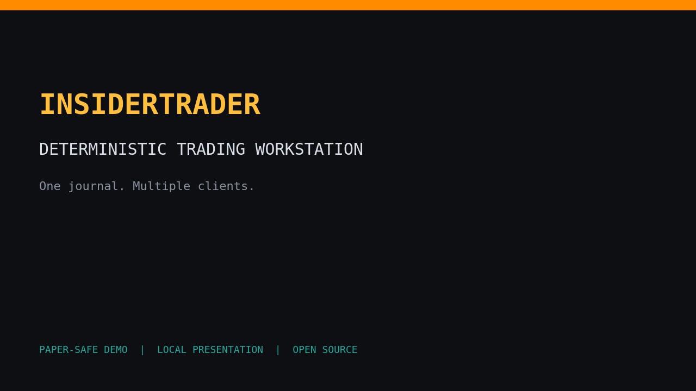

# InsiderTrader

<p align="center">
  <strong>A deterministic trading workstation for people who want their decisions explainable.</strong><br>
  Rust execution core · native terminal · local browser charts · metrics · strategies · optional AI
</p>

<p align="center">
  <a href="LICENSE"></a>
  <a href="Cargo.toml"></a>
  
</p>

<p align="center"></p>

<p align="center"><a href="docs/media/insidertrader-demo.mp4">▶ Watch the MP4 demo</a> · <a href="docs/media/README.md">Create a real paper-mode recording</a></p>

> InsiderTrader is an open-source, paper-first foundation—not financial advice and not a promise of profit. Live trading is intentionally gated by external certification evidence.

## Why it exists

Most trading tools blur research, UI state, model output, and broker state together.
InsiderTrader keeps those boundaries explicit: market state feeds metrics, metrics feed
versioned strategies, proposals pass deterministic portfolio/risk checks, and only then
does the execution gateway talk to a broker. An LLM can explain and coordinate evidence;
it cannot become the source of truth for an order.

## Try it in two minutes

```bash
# Clone this repository (or your fork), then:
cd insiderTrader
./scripts/insider setup
./scripts/insider
```

The setup wizard is bounded and atomic. API keys are optional and remain process-only.
The default launcher starts a paper-safe headless runtime plus a terminal renderer. Type
`CHART AAPL` to open the local browser chart, `STRAT` to inspect starter strategies, or
`HELP` for the full function directory. Use `GP AAPL` for the native chart renderer.

Run the server and clients separately when deploying across machines:

```bash
./scripts/insider server       # authoritative journal/runtime
./scripts/insider terminal     # any number of local renderers
```

See the [operator guide](docs/runbooks/operator-guide.md) for paper startup, recovery,
backups, and the live-trading certification boundary.

## Product tour

| Surface | What users get |
| --- | --- |
| Local browser chart | Familiar candles, overlays, pan/zoom, trend lines, Fib retracements, boxes, levels, and a read-only coordination sidebar |
| Native terminal | Keyboard-first functions, dense tables, bounded scrolling, themes, connection safety popup, and offline waiting/reconnect |
| Strategy coordinator | Starter metrics and traditional strategies that emit typed proposals with confidence, horizon, evidence, and risk budgets |
| AI control plane | Manual, hybrid, and autonomous modes; versioned prompts; streaming analysis; finite schema-validated actions |
| Risk and execution | Preview/confirm workflow, idempotent commands, journal authority, broker reconciliation, and drawdown/liquidation-risk alerts |
| News context | Provider adapters, deterministic relevance/recency/source sorting, deduplication, and optional LLM enrichment |

## Architecture at a glance

```text
Market / news / account state
              ↓
       Feature state + metrics
              ↓
       Versioned strategies
              ↓
 Strategy coordinator + optional AI
              ↓
 Portfolio targets → risk → execution → broker → reconciliation
```

The runtime is authoritative. Terminals and browser charts are clients; closing a
renderer never stops autonomous server-side work. Every trading-relevant mutation is
authenticated, version-checked, idempotent, and journaled.

InsiderTrader is a deterministic, deadline-aware trading engine and professional
native terminal workstation. Read `AGENTS.md` for normative architecture and `PLAN.md` for
the production implementation and certification gates.
See [`CHANGELOG.md`](CHANGELOG.md) for the current release boundary and explicit
distinction between implemented behavior and pending operational certification.

The implementation is under active construction. No gate is complete until its
same-revision evidence exists under `evidence/gates/`.

Operators should use the [operator runbook](docs/runbooks/operator-guide.md) for
installation, paper startup, outages, reconciliation, backup/restore, and any
paper-to-live change. It keeps broker state and the journal authoritative and
does not permit live mode without certification evidence. Record incidents with
the [incident template](docs/runbooks/incident-template.md) so risk transitions,
reconciliation, approvals, and evidence hashes are retained consistently.
Release candidates must additionally follow the [release certification runbook](docs/runbooks/release-certification.md)
before any live canary.

## Local verification

```bash
./scripts/check.sh
```

For discoverable contributor shortcuts, `make test` runs the Rust and Python
tests; `make terminal-build` builds the native workstation; `make fmt` checks
Rust formatting. These aliases do not replace the full `make check` gate.
Run `make doctor` first to verify the pinned Rust and Python versions.

Before starting a long-running paper process, run `make paper-check`. It copies the
example configuration into a private temporary directory and executes the real
runtime composition root with `--check`; configuration bounds, journal
recovery, catalog, broker, risk, provider, and package registration must all pass.
The check does not bind a socket, spawn schedulers, or touch repository data.

For a single-command Arch workstation workflow, use `scripts/insider-manager`.
It validates the CFG through the real composition root, starts the engine on
a deployment-owned Unix socket, and launches the native terminal against that socket:

```bash
./scripts/insider-manager check
./scripts/insider-manager start   # terminal 1
./scripts/insider-manager terminal # terminal 2
# or start both together
./scripts/insider-manager run
```

If the configured market/news endpoint is unavailable, the terminal keeps the failure
visible in Health and Alerts; it never substitutes
synthetic prices. Change the provider URL or symbol mapping in the deployment CFG,
apply it with the version-checked `CONFIG LOAD` command, and restart the manager when required.
For the long-running launcher, `make paper` is deliberately fail-closed and requires
`IT_CONFIG`, `IT_JOURNAL`, and `IT_SOCKET` deployment-owned paths; `IT_ACCOUNT`
defaults to `1`:

```bash
IT_CONFIG=data/insidertrader.cfg \
IT_JOURNAL=data/runtime.journal \
IT_SOCKET=data/runtime.sock \
IT_ACCOUNT=1 make paper
```

For the simplest local workflow, use the repository launcher. It creates
`data/insidertrader.cfg` from the example only when that file is absent (an
existing deployment configuration is never overwritten), starts one headless
runtime, and attaches a native terminal:

```bash
./scripts/insider setup   # first run: inspect/edit the deployment CFG
./scripts/insider          # runtime + terminal
```

To make the same launcher available as the literal `insider` command, install
the workspace binary once:

```bash
cargo install --locked --path crates/launcher
insider setup
insider
```

If a previous run left a stale socket or journal lock, reset the deployment
configuration and those stale coordination files with an explicit confirmation:

```bash
insider reset
# type RESET when prompted, then:
insider setup
insider
```

`insider reset --yes` is available for scripted recovery. It refuses to remove
anything while a runtime process is alive and preserves the journal/trading
history. Setup optionally prompts for `IT_NEWSAPI_KEY` and `IT_LLM_API_KEY`; when
`insider` starts the runtime, entered values are passed only to that child process
and are never written to CFG, snapshots, logs, or the journal. For persistence,
configure those variables through your secret manager/environment before running
`insider`.

Interactive setup is also the configuration setter: it offers bounded choices for
trading mode (`MANUAL`, `HYBRID`, `AUTONOMOUS`), terminal theme, deterministic news
ordering (`RELEVANCE`, `RECENCY`, `SOURCE`), and an optional LLM system prompt. Use
`insider configure` as an explicit alias. Preference updates are committed atomically;
provider API keys remain process-only secret inputs.

To split server and renderer, run `insider server` on the server and attach with
`IT_SOCKET=/path/to/runtime.sock insider terminal` on each local terminal. Multiple
terminals may attach to one socket, and each can open its own local `TV` browser
chart. All clients remain views/control-plane connections to the one journal-backed
runtime; they never create independent trading state.

The full-screen workstation is a native Rust binary. It has no WebView, Node, npm,
or Tauri runtime dependency. An optional `TV` function serves the current graph and
a read-only coordination sidebar on loopback and opens it in the system browser:

```bash
cargo build --locked -p insider-terminal
IT_ENGINE_SOCKET=data/runtime.sock cargo run --locked -p insider-terminal
# bounded machine-readable connectivity probe
IT_ENGINE_SOCKET=data/runtime.sock cargo run --locked -p insider-terminal -- --snapshot
```

Inside the workstation, type a function mnemonic and press Enter/`GO`. `CHART [instrument]`
opens the local browser chart by default; use `GP [instrument]` for the native terminal
renderer. Security-first
navigation accepts `AAPL GP`, `AAPL EQUITY DEPTH`, and `AAPL NEWS`; function-first
forms such as `GP AAPL` also work. Tab completes functions and bounded arguments,
while Ctrl-P/Ctrl-N traverses session-only command history. See [TERMINAL.md](TERMINAL.md).
Use `TV` or `TV AAPL` to launch the local asynchronous browser chart; no remote
TradingView widget or browser-side trading connection is used.
From `AUTO`, Up/Down and Enter request a risk preview for the selected strategy
proposal; `CONFIRM` remains a separate command and is never implied by selection.

## Typed `.cfg` setup

Start from [`config/example.cfg`](config/example.cfg) and pass the deployment-owned
copy to the runtime:

```bash
mkdir -p data
test ! -e data/insidertrader.cfg || { echo "data/insidertrader.cfg already exists; refusing overwrite" >&2; exit 1; }
install -m 0600 config/example.cfg data/insidertrader.cfg
cargo run --locked -p insider-runtime -- serve \
  --config data/insidertrader.cfg \
  --journal data/runtime.journal \
  --socket data/runtime.sock \
  --account 1 \
  --instrument 1 --symbol AAPL --price 100000
```

The `--instrument`/`--price` pair is a deterministic paper-demo quote fixture;
remove it when using an authoritative configured market provider. It is never a
live mark and cannot enable live trading.

The file uses bounded `key = value` syntax. `cfg-core` rejects duplicate keys,
invalid scalars, non-finite numbers, oversized input, and malformed strings before
the engine starts. Values in the file are authoritative for typed risk and alert
settings; matching legacy environment variables are fallback values only when a
key is absent. Operators edit a deployment-owned copy and use `CONFIG LOAD <path>`
to atomically reload it through an authenticated compare-and-swap version, so a stale
terminal client cannot silently overwrite a newer policy. API keys and other credentials do not belong in
`.cfg`; keep them in the deployment secret manager/environment boundary.
Configured provider and article URLs are bounded to 2,048 UTF-8 bytes, require HTTPS with a
non-empty authority, and reject whitespace and username/password credentials. Local HTTP is
reserved for explicitly allowlisted local LLM inference endpoints; NewsAPI, Yahoo, RSS, and IBKR
configuration remains HTTPS-only. The engine and provider adapters enforce this again at runtime.
The example also contains bounded operational keys for Python worker isolation,
execution cadence, market freshness/provider tuning, and LLM base URL/timeout; these
use the same file-first, environment-fallback rule at startup. Python worker
`cpu_seconds` is bounded to 1–86,400 and `memory_bytes` to 64 MiB–8 GiB before a
worker is registered. The commented settings in `config/example.cfg` document Python
isolation and Yahoo adapter controls; direct `.cfg` editing remains available for
deployment automation.
For bounded Yahoo multi-symbol polling, set `market.yahoo_symbols` to a comma-separated
`SYMBOL=INSTRUMENT_ID` list (up to 128 subscriptions); `IT_YAHOO_SYMBOLS` remains the
fallback when the CFG key is absent.
For NewsAPI top-headlines, `.cfg` can set `news.newsapi_country`,
`news.newsapi_category`, or `news.newsapi_sources`; at least one filter is required
for that endpoint and each value is validated before startup.
`terminal.status_poll_ms` controls the terminal's observational provider, broker, risk, supervisor,
and strategy status refresh cadence. It accepts 1,000–60,000 ms (default 5,000).
`terminal.alert_poll_ms` controls alert refresh cadence (500–60,000 ms, default 1,000), while
`terminal.news_stale_after_ms` and `terminal.analyst_stale_after_ms` control freshness warnings (each
60,000–3,600,000 ms, default 300,000). These remain presentation/observability settings
rather than broker state.
Each bounded refresh batch completes before the next one is scheduled, so lowering the values
cannot create overlapping diagnostic requests.
`terminal.news_stale_after_ms` controls when the News function marks its last successful page stale;
the CFG parser enforces 60,000–3,600,000 ms (default 300,000) during atomic reload.

Python research workers use the same bounded contracts as the Rust runtime:

```python
from insidertrader.metric_sdk import MetricDescriptor, MetricOutput, validate_output
from insidertrader.strategy_sdk import Action, Proposal, validate_proposal
```

`MetricOutput.to_wire()` and `Proposal.to_wire()` emit JSON-safe objects with
canonical IDs and explicit freshness/TTL fields. These SDKs produce proposals
only; broker credentials and order submission remain outside the worker process.

Live trading is disabled until the per-asset G07 and integrated G15 certifications
are complete.

Python metric and strategy workers run out of process with framed IPC, a bounded
working directory (`python.workdir` or `IT_PYTHON_WORKDIR`, default
`data/python-workers`), CPU and address-space limits (`python.cpu_seconds` or
`IT_PYTHON_CPU_SECONDS`, default 3600 seconds per worker; `python.memory_bytes` or
`IT_PYTHON_MEMORY_BYTES`, default 512 MiB), no user-site imports, and network
sockets disabled by default.
Network access requires the explicit `python.allow_network = true` CFG setting
(with `IT_PYTHON_ALLOW_NETWORK` retained only as fallback).

The headless runtime accepts `--instrument ID --symbol SYMBOL --price TICKS` for a
canonical paper instrument. When those arguments are present, Yahoo quote polling
is enabled by default through the non-authoritative `/v7/finance/quote` adapter;
`IT_YAHOO_QUOTE_POLL_MS` controls its bounded interval (1–300 seconds). Quote
failure only marks the provider degraded and never bypasses broker/risk state.
Yahoo quote marks are disabled automatically when `IT_BROKER=ibkr`; enabling
`market.allow_yahoo_live_marks = true` in CFG (or its fallback environment variable)
is an explicit operator policy override.
For paper/research multi-symbol polling, set `IT_YAHOO_SYMBOLS` to a bounded
comma-separated list of `SYMBOL=INSTRUMENT_ID` entries (maximum 128 workers).
Those entries also bootstrap provider-qualified canonical catalog records, so
watchlist resolution and quote ingestion use the same instrument identity. Each
worker emits the same canonical quote event and uses the same interval and
price-scale controls; malformed entries are ignored rather than guessed.
In IBKR mode, the runtime also rejects synthetic `--price` bootstrap
marks by default; `broker.allow_ibkr_bootstrap_mark = true` in CFG (or its fallback
environment variable) is required for a deliberate non-authoritative test override.
Authoritative IBKR quote polling can be enabled with `broker.ibkr_conid` and
`broker.ibkr_instrument_id`; `IT_IBKR_MARKET_POLL_MS` is bounded to 250–60,000 ms
and `IT_IBKR_PRICE_SCALE` defines the integer-tick conversion (default 10,000).
Snapshots are accepted only when bid/ask ordering and finite positive canonical
values are valid; provider failures leave the existing stream state unchanged.
The decision scheduler marks quote, trade, and book streams stale when no
accepted event arrives within `IT_MARKET_MAX_AGE_MS` (default 60,000 ms,
bounded to 250–86,400,000 ms). The transition is exposed in runtime health and
never fabricates a replacement price.
Risk caps can be overridden explicitly with positive `IT_MAX_POSITION_TICKS` and
`IT_MAX_GROSS_NOTIONAL_TICKS` values; malformed or non-positive values fail startup.
Contextual risk guardrails are configured in the atomic engine settings snapshot
using `risk.max_leverage` (finite non-negative ratio), `risk.max_drawdown_bps`
(non-negative basis points), `risk.max_outstanding_orders`,
`risk.max_predicted_volatility_bps`, `risk.max_participation_bps`,
`risk.max_message_rate`, and `risk.max_price_deviation_bps` (all non-negative
integers). They are evaluated immediately before every proposal or manual target
becomes an order intent, using reconciled marks/equity and the local working-order
projection. Missing marks, non-positive equity for leverage, or missing high-water
drawdown state deny the order. Guardrail fields whose authoritative observation
is not yet wired are rejected during configuration rather than interpreted as
zero; config reload updates the active policy only after validation succeeds.
The runtime maps these settings from matching `IT_MAX_*` environment
variables only as a backward-compatible fallback when the corresponding `.cfg`
key is absent; malformed or negative values fail startup before the engine accepts
orders. Predicted-volatility, participation, and price-deviation limits fail
closed until their authoritative observation is available; they are never
interpreted as zero. Message rate is measured from planning boundaries in a
bounded monotonic one-second window and is therefore enforceable locally.
For limit orders, price-deviation guardrails use the reconciled mark and the
requested limit price; market orders and proposals are denied when that guard is
enabled because no client price is available at planning time.
Set `IT_ALERT_WEBHOOK_URL` to an HTTPS endpoint to enable bounded webhook alert
delivery. Delivery runs off the trading path with a two-second request timeout;
only HTTP 2xx acknowledges the webhook copy, while the terminal alert remains
until manually acknowledged. Webhook configuration changes require restart.
Semantic context retrieval can be enabled explicitly with
`IT_EMBEDDING_MODEL`, `IT_EMBEDDING_MODEL_VERSION`, and
`IT_EMBEDDING_DIMENSIONS` (1–4096). These settings are all-or-none and are
validated before the engine enters reconciliation; without them, exact,
lexical, and graph retrieval remains the deterministic fallback.
The runtime composition root also registers the compiled `volatility.ewma.v1`
metric through the normal metric host. Its ID, lambda, and TTL are configurable
with `IT_EWMA_METRIC_ID`, `IT_EWMA_LAMBDA`, and `IT_EWMA_TTL_NS`.
The same composition root registers the compiled reference `trend.sma.v1`,
`liquidity.spread.v1`, and `microstructure.imbalance.v1` metrics. Their IDs and
shared TTL are configurable with `IT_SMA_METRIC_ID`, `IT_SPREAD_METRIC_ID`,
`IT_IMBALANCE_METRIC_ID`, and `IT_REFERENCE_METRIC_TTL_NS`; `IT_SMA_WINDOW`
controls the bounded SMA warm-up window. These metrics consume canonical quote,
bar, and book-quantity features and are evaluated through the same validated host
as Python metrics.
The deterministic threshold reference strategy is available through the same
coordinator when `IT_ENABLE_REFERENCE_STRATEGY=true` (or `1`). It consumes the
book-imbalance metric and remains disabled by default; its strategy ID, thresholds,
quantity, horizon, and TTL are controlled by `IT_REFERENCE_STRATEGY_ID`,
`IT_REFERENCE_ENTRY_THRESHOLD`, `IT_REFERENCE_EXIT_THRESHOLD`,
`IT_REFERENCE_QUANTITY_TICKS`, `IT_REFERENCE_HORIZON_NS`, and
`IT_REFERENCE_STRATEGY_TTL_NS`.
